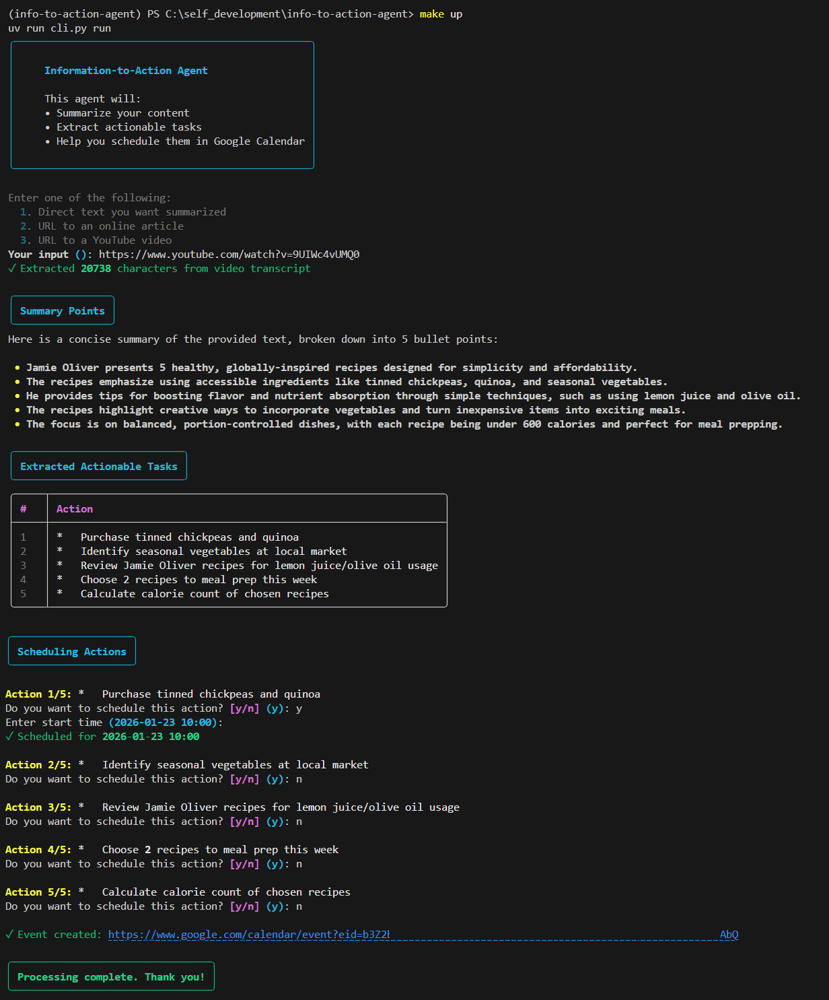

# Information-to-Action Calendar-Integrated Agent

This agent summarizes articles or YouTube videos into key points, extracts actionable tasks, and schedules them on your Google Calendar.



## Prerequisites

- [uv](https://github.com/astral-sh/uv) - Fast Python package installer and resolver
- Python 3.13+
- A Google Cloud account

## Quick Start

1. Install dependencies with `uv`:
   ```bash
   uv sync
   ```

2. Set up your `.env` file with `GOOGLE_API_KEY`

3. Place your `credentials.json` in the project root

4. Run the agent:
   ```bash
   make up
   ```
   
   Or directly:
   ```bash
   uv run cli.py run
   ```

## Setup Instructions

### 1. Install uv

If you don't have `uv` installed:

**Windows (PowerShell):**
```powershell
powershell -ExecutionPolicy ByPass -c "irm https://astral.sh/uv/install.ps1 | iex"
```

**macOS/Linux:**
```bash
curl -LsSf https://astral.sh/uv/install.sh | sh
```

### 2. Gemini API Key

1. Go to [Google AI Studio](https://aistudio.google.com/app/apikey).
2. Create a new API key.
3. In this project, create a `.env` file:
   ```bash
   GOOGLE_API_KEY=your_key_here
   ```

### 3. Google Calendar API (OAuth)

1. Go to the [Google Cloud Console](https://console.cloud.google.com/).
2. Create a new project named **Info-to-Action**.
3. **Enable API**: Go to "APIs & Services" > "Library" and search for/enable **Google Calendar API**.
4. **OAuth Consent Screen**:
   - Go to "APIs & Services" > "OAuth consent screen".
   - Choose **External**.
   - Fill in the required app information.
   - **IMPORTANT**: Scroll to "Test users" and add your own Google email address. (Required while the app is in "Testing" mode).
5. **Create Credentials**:
   - Go to "APIs & Services" > "Credentials".
   - Click **Create Credentials** > **OAuth client ID**.
   - Select **Application type**: **Desktop app**.
   - Click **Create** and download the JSON file.
6. **Rename and Move**: Move the downloaded JSON into this project folder and rename it exactly to `credentials.json`.

## Installation

Install all dependencies using `uv`:

```bash
uv sync
```

This will:
- Create a virtual environment automatically
- Install all dependencies from `pyproject.toml`
- Set up the project ready to run

## Running the Agent

### Using Make (Recommended)

```bash
make up
```

### Using uv directly

```bash
uv run cli.py run
```

### With options

```bash
# With URL
uv run cli.py run --url "https://example.com/article"

# With direct text
uv run cli.py run --text "Your text here"

# Auto-schedule all actions
uv run cli.py run --url "https://youtube.com/watch?v=..." --auto-schedule
```

### Other commands

```bash
# Test connection
make ping
# or
uv run cli.py ping

# Show help
uv run cli.py --help
```

## How It Works

1. **Input**: Provide a URL (article or YouTube video) or direct text
2. **Content Extraction**: The agent fetches and extracts text content
3. **Summarization**: AI summarizes the content into 5 key bullet points
4. **Action Extraction**: AI extracts 3-5 concrete actionable tasks
5. **Scheduling**: You choose which actions to schedule and when
6. **Calendar Integration**: Selected actions are added to your Google Calendar

## Project Structure

```
src/
├── infra/client/          # External service clients (Google, HTTP, YouTube)
├── modules/agent/          # Agent business logic
│   ├── service/           # Business logic services
│   ├── dto.py             # Data transfer objects
│   └── commands.py        # CLI presentation layer
└── app/                   # Application entry points
    └── typer.py           # Typer CLI commands
```

## Notes

- On the first run, a browser window will open for Google Calendar authorization
- After authorizing, a token will be saved in `storage/tokens/token.json`
- The token is automatically refreshed when it expires
- All tokens and credentials are excluded from git (see `.gitignore`)
